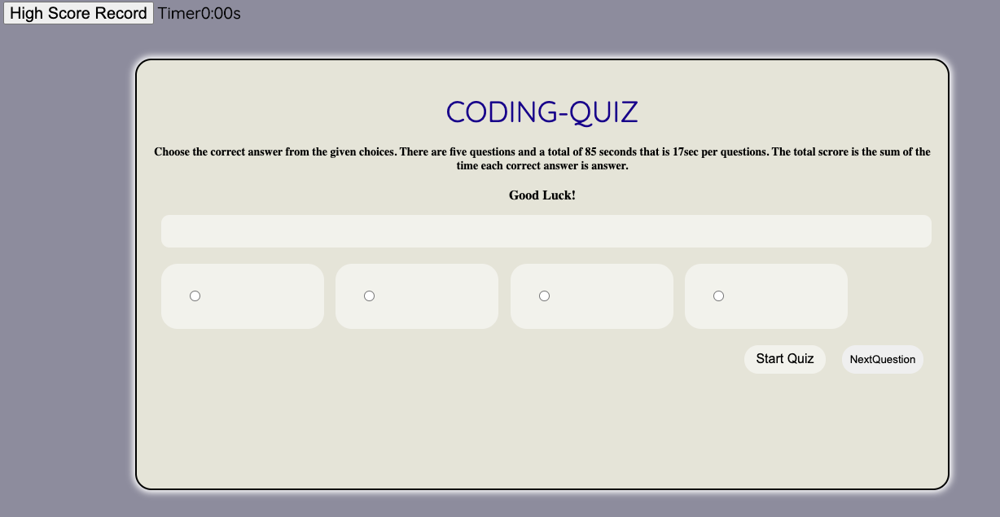

# CODING-QUIZ
This is Coding quiz home work I did an appication for the taking Coding quiz in cluding 5 questions with its choice and correct answer in Array terms.
 In my home work I included index.html, style.css, script.js and screen shot image

 For my style.css I used riferance from youtube and I made risponse page by media quiry.
 It also includes start quiz button, Next quiz button, result and timer button.
I gave 17sec per question totaltime 85 second and startes count from 85second.
 I included font-size google from Boot strap.

URL: https://destish21.github.io/api04-codequiz/
