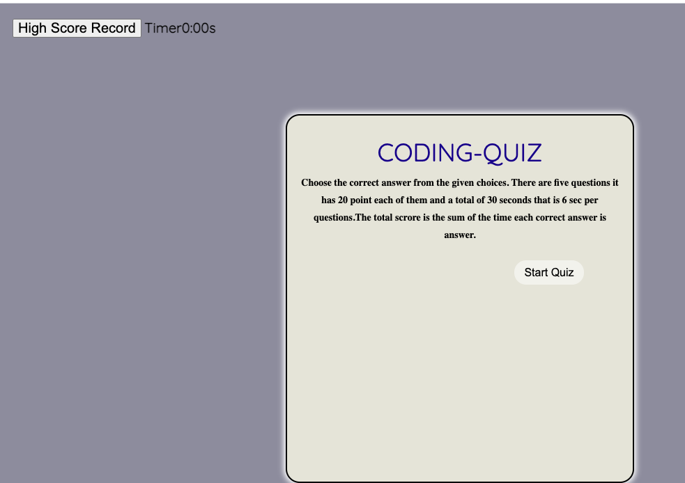
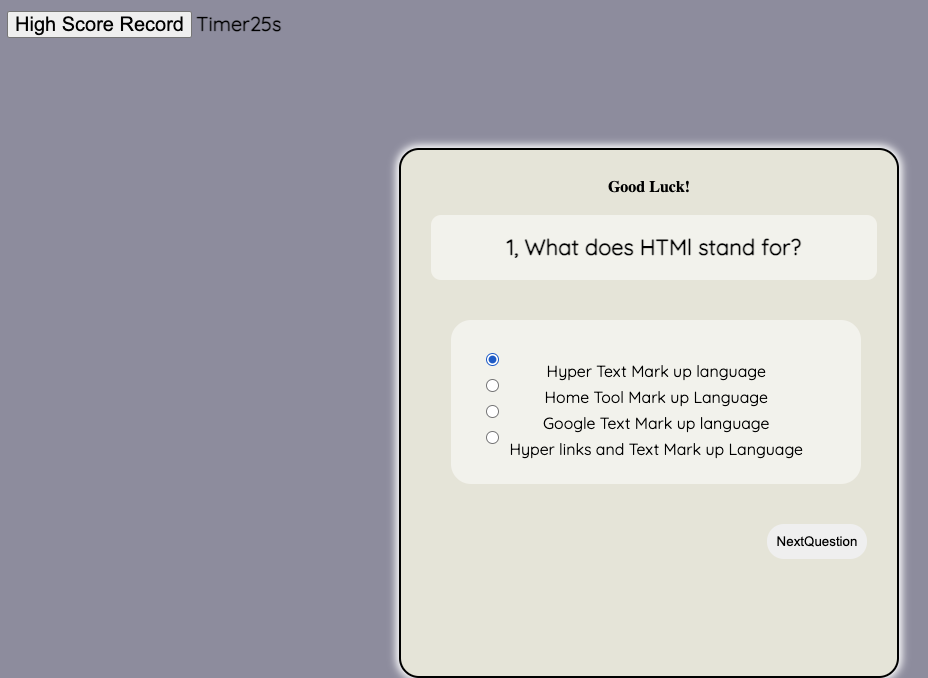
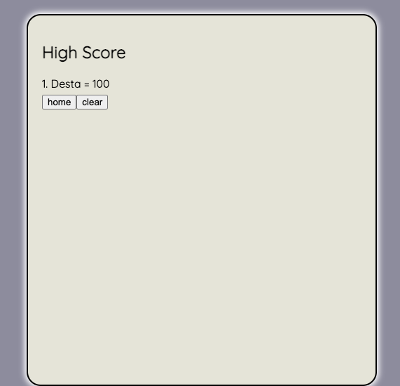

# api04-codequiz
This is Coding quiz home work I did an application for the taking Coding quiz in cluding 5 questions each question has 20 points and you can see your high score when you enter you name.All questions arrenged with its choice and correct answer in Array terms.
 In my home work I included index.html, style.css, script.js and screen shot image

 For my style.css I used reference from youtube and I made risponse page by media quiry.
 It also includes start quiz button, Next quiz button, result and timer button.
I gave 6 sec per question totaltime 30 second and startes count from 30 second.
 I included font-size google from Boot strap.
  When you click start button after the quiz starts you get nextquestion button and last you can store the score in localstorage by enter your name and by click save button. As the some time you can see your scroe in the browser and you can find in localstorage.

URL: https://destish21.github.io/api04-codequiz/ 
